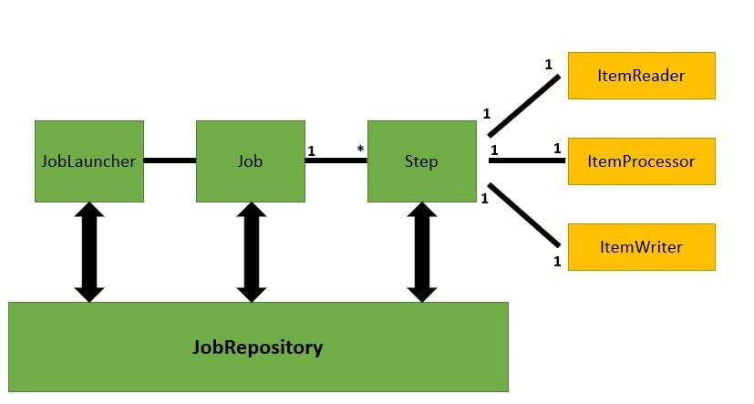

# Spring Boot Batch Example

## Version
- Java : JDK 13
- Spring Boot : 2.7.3
- Build : Gradle 7.5
- Database : H2 In-Memory DB

## How Spring Batch works?

## Connection  information
- Invoke job : http://localhost:8080/invokejob
- H2 Database console : http://localhost:8080/h2-console